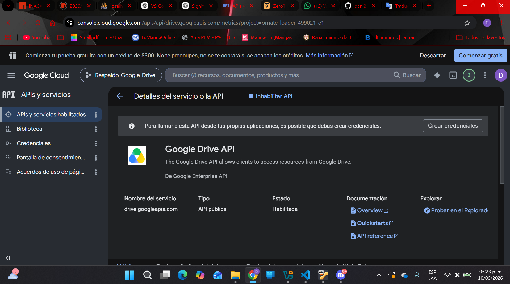
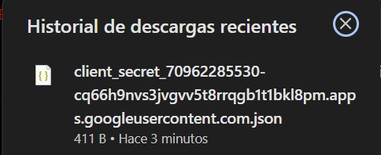
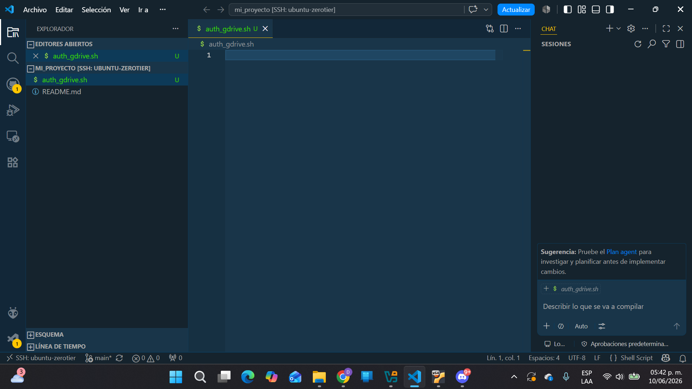
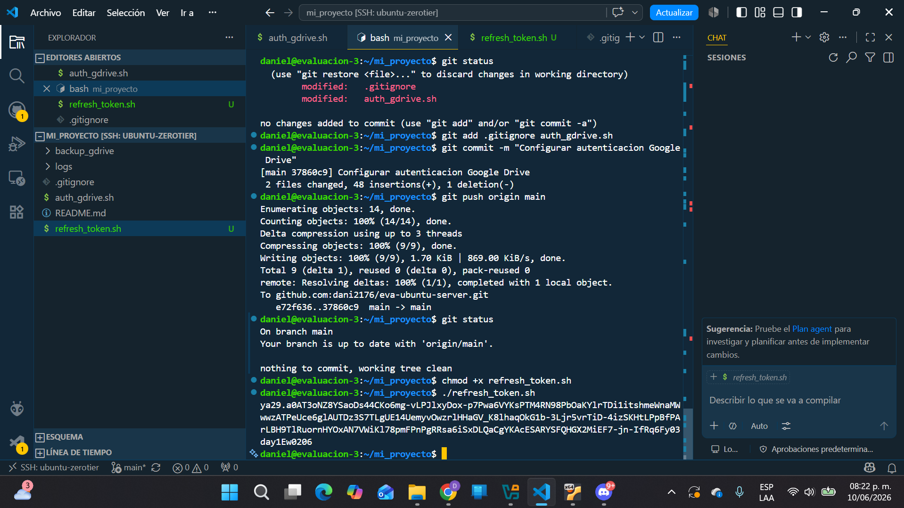
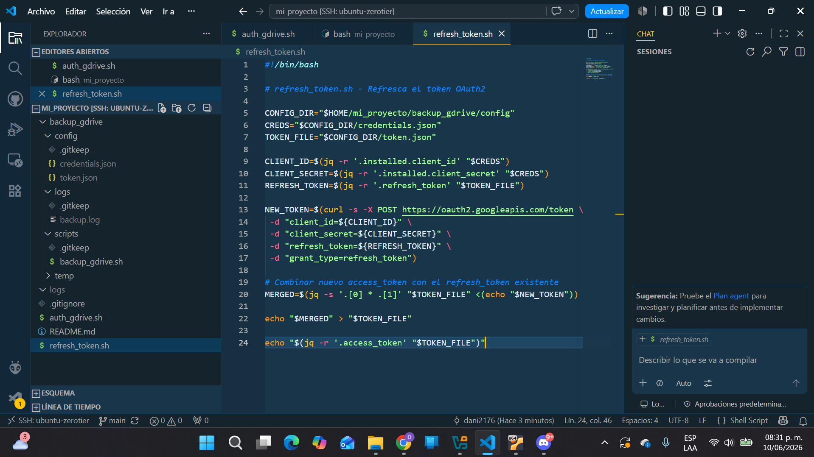

# Sistema de Respaldo Automático a Google Drive con Bash

## Autores

### Daniel Videla

Responsabilidades:

* Instalación y configuración de Ubuntu Server.
* Configuración de Git y GitHub.
* Configuración de ZeroTier.
* Configuración de acceso remoto mediante SSH.
* Implementación de autenticación OAuth2 con Google.
* Desarrollo del script `auth_gdrive.sh`.
* Desarrollo del script `refresh_token.sh`.
* Configuración de Google Cloud Console.
* Integración con Google Drive API.
* Pruebas de autenticación y generación de tokens.

### Nicolas Bastidas

Responsabilidades:

* Desarrollo del script principal de respaldo.
* Implementación de compresión mediante `tar`.
* Automatización de generación de archivos `.tar.gz`.
* Implementación del sistema de logs.
* Integración de subida de archivos a Google Drive.
* Validación de respaldos generados.
* Pruebas de funcionamiento del sistema completo.
* Corrección de errores y optimización del script final.

---

# Descripción del Proyecto

Este proyecto consiste en un sistema automatizado de respaldo desarrollado en Bash para Ubuntu Server.

El sistema genera una copia comprimida del proyecto, la almacena temporalmente en el servidor y posteriormente la envía automáticamente a Google Drive utilizando la API oficial de Google Drive y autenticación OAuth2.

Además, todas las acciones realizadas por el sistema quedan registradas en un archivo de log para facilitar la supervisión y auditoría de los respaldos.

---

# Objetivos

## Objetivo General

Desarrollar un sistema automatizado de respaldo utilizando Bash y Google Drive como plataforma de almacenamiento en la nube.

## Objetivos Específicos

* Generar respaldos automáticos comprimidos.
* Implementar autenticación segura mediante OAuth2.
* Automatizar la actualización de tokens.
* Almacenar respaldos en Google Drive.
* Registrar eventos en archivos de log.
* Aplicar trabajo colaborativo utilizando GitHub.

---

# Tecnologías Utilizadas

* Ubuntu Server 22.04
* Bash Script
* Google Drive API
* OAuth2
* Git
* GitHub
* Visual Studio Code
* Remote SSH
* ZeroTier
* curl
* jq
* tar

---

# Estructura del Proyecto

text

mi_proyecto/
│
├── auth_gdrive.sh
├── refresh_token.sh
├── README.md
├── .gitignore
│
├── backup_gdrive/
│
├── config/
│   ├── credentials.json
│   ├── token.json
│   └── .gitkeep
│
├── logs/
│   ├── backup.log
│   └── .gitkeep
│
├── scripts/
│   ├── backup_gdrive.sh
│   └── .gitkeep
│
└── temp/
    ├── backup_fecha.tar.gz
    └── .gitkeep
```

---

# Instalación Paso a Paso

## 1. Actualizar Ubuntu

bash

sudo apt update
sudo apt upgrade -y
```

---

## 2. Instalar Dependencias

Instalar Git:

bash

sudo apt install git -y
```

Instalar Curl:

bash

sudo apt install curl -y
```

Instalar jq:

bash

sudo apt install jq -y
```

Verificar instalación:

bash

git --version
curl --version
jq --version
```

---

## 3. Clonar el Repositorio

bash

git clone git@github.com:dani2176/eva-ubuntu-server.git
```

Ingresar al proyecto:

bash

cd eva-ubuntu-server
```

---

## 4. Configuración de Google Cloud

### Crear Proyecto

1. Acceder a Google Cloud Console.
2. Crear un nuevo proyecto.
3. Habilitar Google Drive API.

### Crear Credenciales OAuth

1. APIs y Servicios.
2. Credenciales.
3. Crear ID de Cliente OAuth.
4. Aplicación de Escritorio.
5. Descargar archivo JSON.

Guardar el archivo descargado como:

text

backup_gdrive/config/credentials.json
```

---

## 5. Generar Token de Acceso

Dar permisos:

bash

chmod +x auth_gdrive.sh
```

Ejecutar:

bash

./auth_gdrive.sh
```

El script mostrará una URL.

1. Abrir la URL en un navegador.
2. Autorizar acceso a Google Drive.
3. Copiar el código entregado por Google.
4. Pegar el código en la terminal.

Se generará automáticamente:

text

backup_gdrive/config/token.json
```

---

## 6. Actualizar Token

Ejecutar:

bash

./refresh_token.sh
```

Este script genera automáticamente un nuevo Access Token utilizando el Refresh Token almacenado.

---

## 7. Ejecutar Respaldo

Dar permisos:


bash

chmod +x backup_gdrive/scripts/backup_gdrive.sh
```

Ejecutar:

bash

./backup_gdrive/scripts/backup_gdrive.sh
```

El sistema realizará:

1. Compresión del proyecto.
2. Generación del archivo `.tar.gz`.
3. Actualización automática del token.
4. Subida a Google Drive.
5. Registro de eventos en el log.

---

# Trabajo Colaborativo

Para permitir el desarrollo desde ubicaciones distintas se implementó:

## ZeroTier

Se creó una red privada virtual que permitió conectar ambos equipos al servidor Ubuntu.

## SSH

Se habilitó acceso remoto seguro al servidor.

## Visual Studio Code Remote SSH

Permitió editar archivos directamente desde cada computador sin necesidad de trabajar físicamente en el servidor.

## GitHub

Se utilizó para:

* Control de versiones.
* Sincronización del proyecto.
* Trabajo colaborativo.
* Respaldo del código fuente.

---

# Evidencias

















---

# Resultados Obtenidos

Se logró implementar exitosamente un sistema de respaldo automático funcional utilizando Bash y Google Drive API.

El sistema permite:

* Generar respaldos comprimidos.
* Subir archivos automáticamente a Google Drive.
* Mantener autenticación segura mediante OAuth2.
* Registrar todas las operaciones realizadas.
* Trabajar colaborativamente desde diferentes ubicaciones utilizando GitHub y Visual Studio Code Remote SSH.

---

# Repositorio

GitHub:

[git@github.com](mailto:git@github.com):dani2176/eva-ubuntu-server.git
