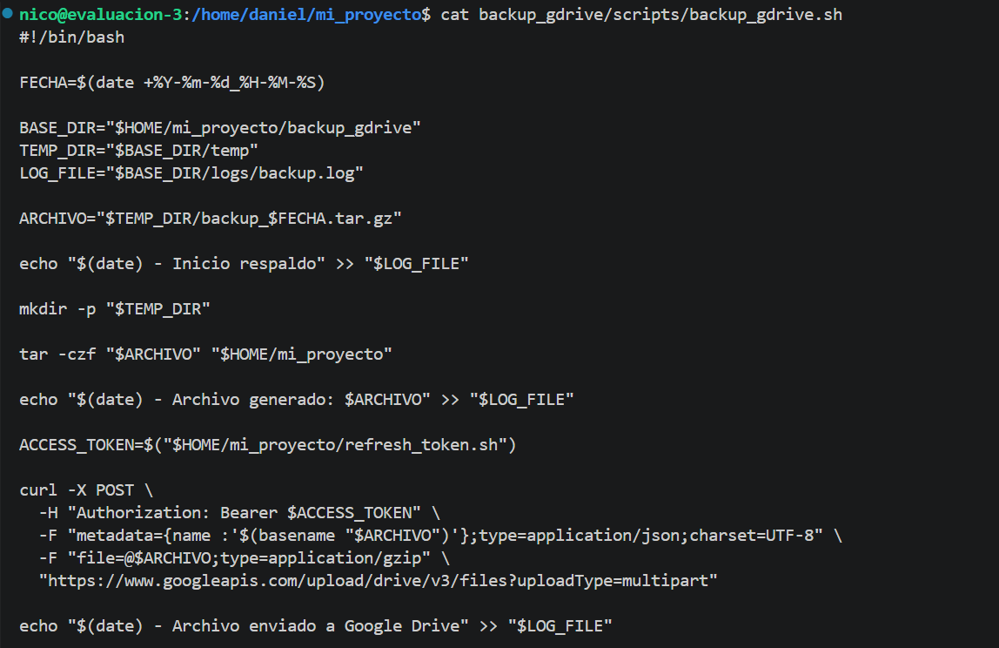
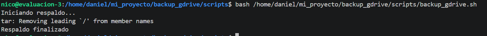
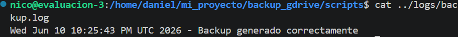
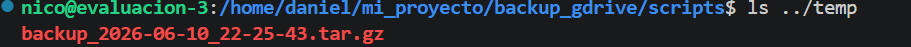
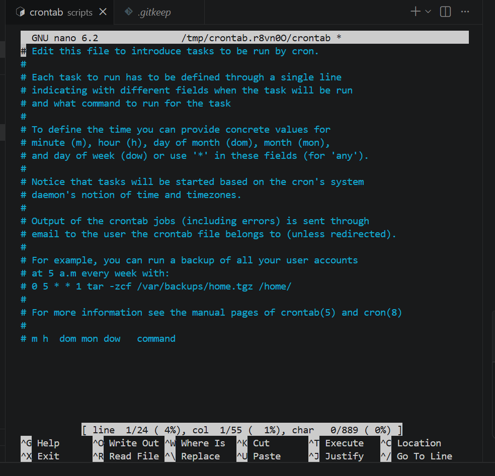
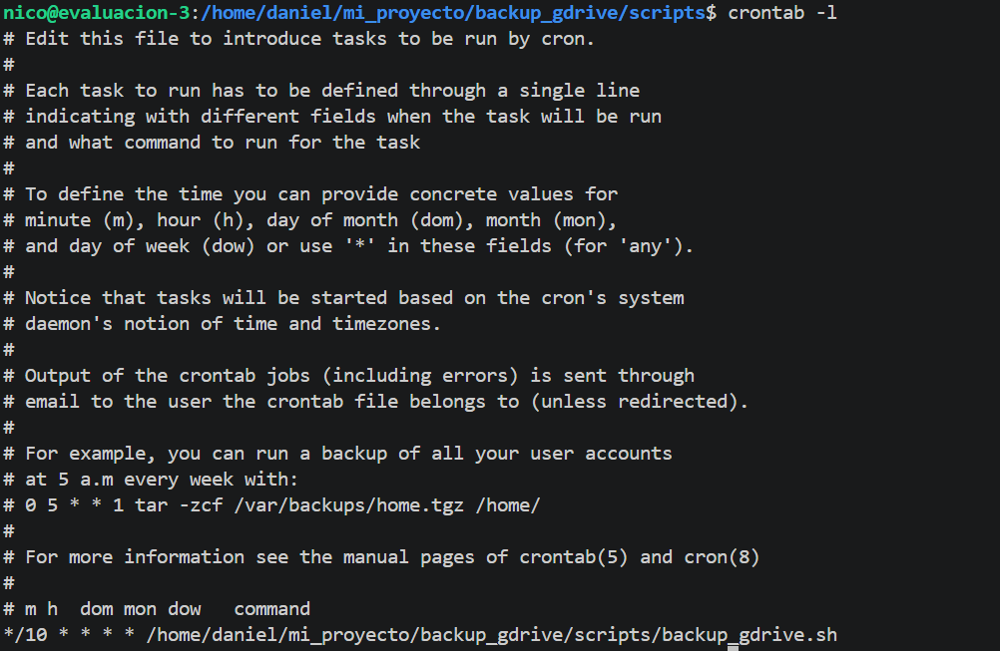
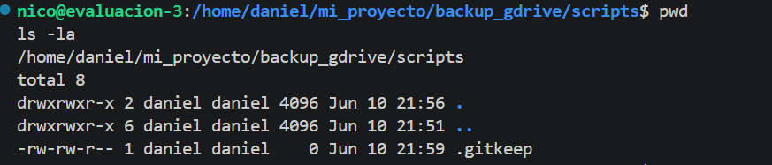
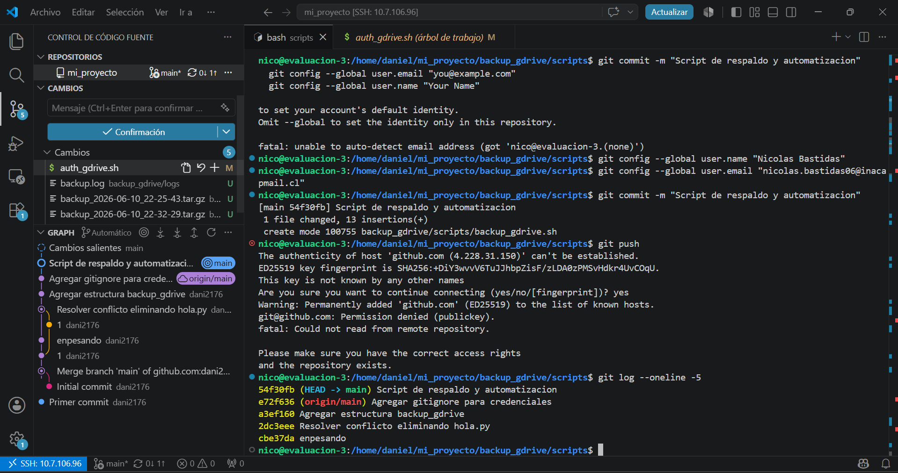
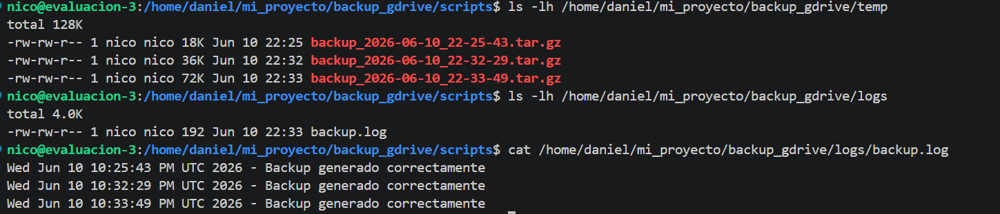

# Sistema de Respaldo Automático en Google Drive

## Descripción

Proyecto desarrollado en Ubuntu Server mediante conexión SSH desde Visual Studio Code.

El objetivo del proyecto es implementar un sistema automatizado de respaldo de archivos utilizando Google Drive como almacenamiento en la nube. Para ello se configuró la autenticación OAuth 2.0, la API de Google Drive, scripts Bash y tareas programadas mediante Cron.

---


# Distribución del Trabajo

## Daniel Videla

* Creación y configuración del repositorio GitHub.
* Conexión remota mediante SSH desde Visual Studio Code.
* Creación de la estructura del proyecto.
* Desarrollo y pruebas de scripts Bash.
* Configuración de permisos de ejecución.
* Integración con Git y GitHub.
* Elaboración de documentación y README.
* Registro y recopilación de evidencias.

## Nicolas Bastidas

* Configuración del proyecto en Google Cloud.
* Habilitación de Google Drive API.
* Configuración de OAuth 2.0.
* Generación de credenciales.
* Validación de autenticación con Google Drive.
* Configuración de tareas programadas mediante Cron.
* Verificación de respaldos y pruebas finales.

---

# Tecnologías Utilizadas

* Ubuntu Server
* Visual Studio Code (Remote SSH)
* Git
* GitHub
* Bash Script
* Google Cloud Platform
* Google Drive API
* OAuth 2.0
* Cron
* Curl
* jq
* Tar

---

# Estructura del Proyecto

```text
mi_proyecto/
│
├── auth_gdrive.sh
├── refresh_token.sh
├── backup_gdrive/
│   ├── config/
│   │   ├── credentials.json
│   │   └── token.json
│   │
│   ├── logs/
│   │
│   ├── scripts/
│   │
│   └── temp/
│
├── imagenes/
│
├── .gitignore
│
└── README.md
```

---

# Funcionalidades

## Autenticación OAuth 2.0

Permite la conexión segura con Google Drive utilizando autorización basada en OAuth.

## Generación de Tokens

Obtención automática de:

* Access Token
* Refresh Token

## Renovación Automática

Actualización automática del token de acceso mediante Refresh Token.

## Respaldo de Archivos

Generación de archivos comprimidos en formato:

```text
.tar.gz
```

## Registro de Eventos

Almacenamiento de actividad y errores mediante archivos de log.

## Automatización

Programación de tareas automáticas mediante Cron.

---

# Configuración de Google Cloud

## Creación del Proyecto

Nombre del proyecto:

```text
Respaldo-Google-Drive
```

## API Habilitada

```text
Google Drive API
```

## Configuración OAuth

Tipo de aplicación:

```text
Aplicación de escritorio
```

Credenciales generadas:

* Client ID
* Client Secret

---

# Scripts Implementados

## auth_gdrive.sh

Funciones:

* Solicitar autorización OAuth.
* Obtener código de autorización.
* Generar token inicial.
* Guardar token.json.

---

## refresh_token.sh

Funciones:

* Renovar Access Token.
* Utilizar Refresh Token.
* Actualizar token.json automáticamente.

---

## backup_gdrive.sh

Funciones:

* Crear respaldo comprimido.
* Registrar actividad en logs.
* Subir archivos a Google Drive.
* Gestionar respaldos temporales.

---

# Comandos Utilizados

## Permisos de ejecución

```bash
chmod +x auth_gdrive.sh
chmod +x refresh_token.sh
chmod +x backup_gdrive.sh
```

## Autenticación OAuth

```bash
./auth_gdrive.sh
```

## Actualización de Token

```bash
./refresh_token.sh
```

## Ejecución de Respaldo

```bash
./backup_gdrive.sh
```

## Revisión de Logs

```bash
cat backup_gdrive/logs/backup.log
```

---

# Configuración de GitHub

Repositorio utilizado:

```text
eva-ubuntu-server
```

Comandos utilizados:

```bash
git add .
git commit -m "mensaje"
git push origin main
git pull origin main
```

---

# Configuración de .gitignore

```text
# Credenciales Google
credentials.json
client_secret*.json
token.json
backup_gdrive/config/*.json

# Logs
*.log
logs/
backup_gdrive/logs/

# Respaldos temporales
*.tar.gz
backup_gdrive/temp/

# VS Code
.vscode/

# Python
__pycache__/
*.pyc
```

---

# Evidencias

## Captura 1 – Creación del repositorio


---

## Captura 2 – Creación de auth_gdrive.sh


---

## Captura 3 – Creación del proyecto en Google Cloud


---

## Captura 4 – Google Drive API habilitada


---

## Captura 5 – Creación del cliente OAuth


---

## Captura 6 – Asignación de permisos


---

## Captura 7 – Código de refresh_token.sh


---

## Captura 8 – Editor abierto con auth_gdrive.sh


---

## Captura 9 – Ejecución de refresh_token.sh


---

## Captura 10 – Token generado correctamente


---

## Captura 11 – Código de backup_gdrive.sh



---

## Captura 12 – Ejecución manual del respaldo



---

## Captura 13 – Lectura inicial del log



---

## Captura 14 – Contenido de carpeta temporal



---

## Captura 15 – Edición de crontab



---

## Captura 16 – Verificación de configuración Cron



---

## Captura 17 – Verificación del directorio scripts



---

## Captura 18 – Problemas de conexión y solución



---

## Captura 19 – Inspección final de archivos y logs



---

# Conclusiones

Durante el desarrollo del proyecto se logró implementar exitosamente un sistema automatizado de respaldo utilizando Google Drive como almacenamiento en la nube.

Se configuró la autenticación OAuth 2.0, la API de Google Drive, scripts Bash para automatización de tareas y programación mediante Cron, permitiendo la ejecución automática de respaldos y la gestión segura de credenciales.

El proyecto permitió aplicar conocimientos relacionados con administración de servidores Linux, automatización, servicios en la nube, control de versiones con Git y documentación técnica.

---

# Autor(es)

Daniel Videla
Nicolas Bastidas

Ingeniería en Telecomunicaciones

INACAP
