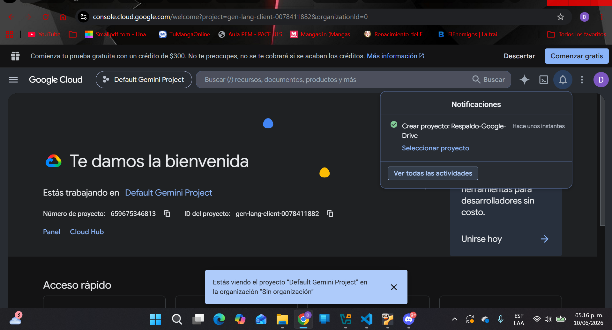
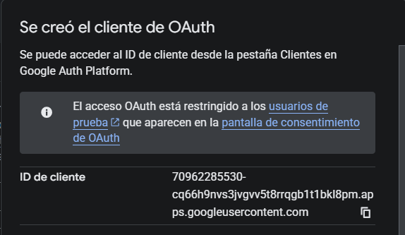
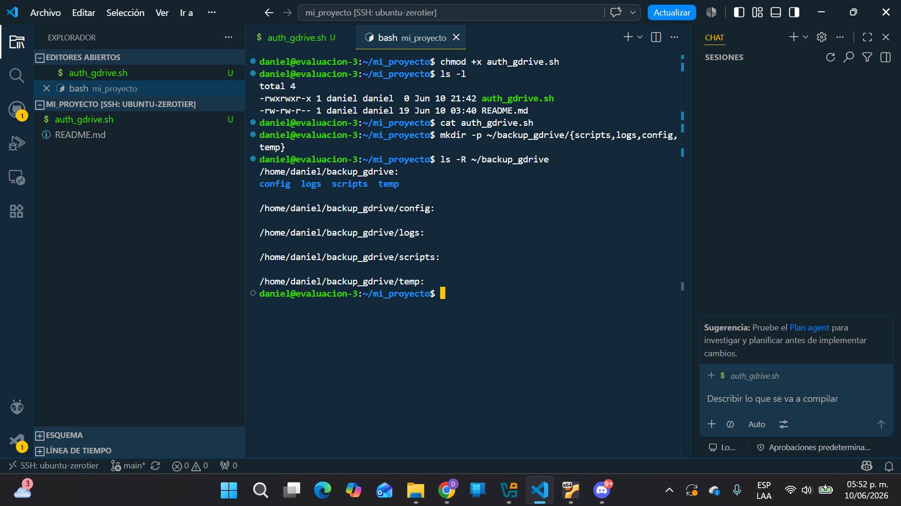
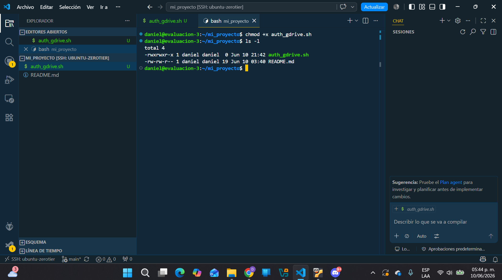
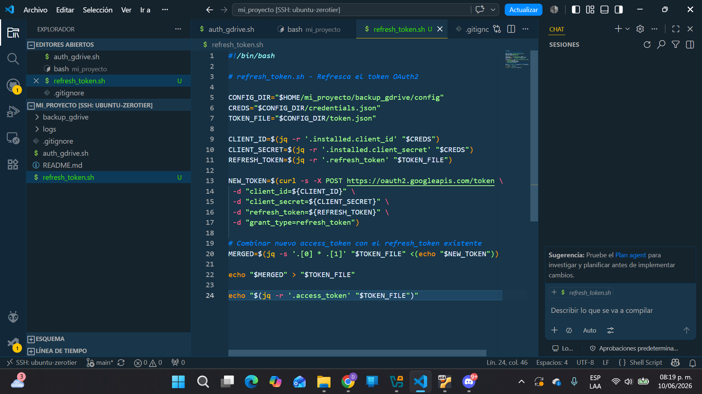
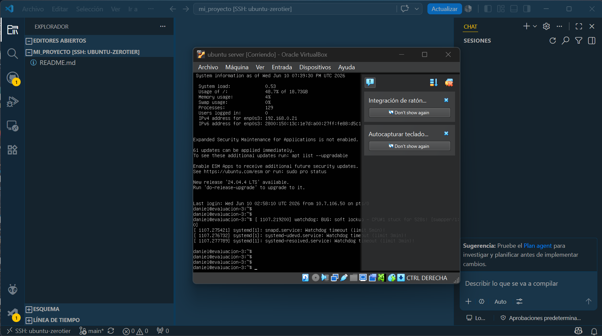

# Sistema de Respaldo Automático a Google Drive con Ubuntu Server

## Descripción

Este proyecto consiste en la creación de un sistema de respaldo automático desarrollado en Ubuntu Server utilizando Bash Script.

El sistema genera respaldos comprimidos del proyecto, registra eventos en archivos de log y posteriormente envía los respaldos a Google Drive mediante la API oficial de Google Drive y autenticación OAuth2.

Además, el proyecto fue desarrollado de forma colaborativa mediante GitHub y conexión remota SSH utilizando Visual Studio Code.

---

# Objetivos

- Automatizar respaldos en Ubuntu Server.
- Utilizar Bash Script para tareas administrativas.
- Implementar autenticación OAuth2.
- Utilizar Google Drive API.
- Registrar eventos mediante logs.
- Trabajar colaborativamente utilizando Git y GitHub.
- Administrar un servidor remotamente mediante SSH.

---

# Tecnologías utilizadas

- Ubuntu Server
- Bash Script
- Git
- GitHub
- Google Cloud Platform
- Google Drive API
- OAuth2
- Visual Studio Code
- SSH
- ZeroTier
- Curl
- jq
- tar

---

# Estructura del proyecto

```text
mi_proyecto/
│
├── auth_gdrive.sh
├── refresh_token.sh
├── README.md
├── .gitignore
│
├── backup_gdrive/
│   │
│   ├── config/
│   │   ├── credentials.json
│   │   ├── token.json
│   │   └── .gitkeep
│   │
│   ├── logs/
│   │   ├── backup.log
│   │   └── .gitkeep
│   │
│   ├── scripts/
│   │   ├── backup_gdrive.sh
│   │   └── .gitkeep
│   │
│   └── temp/
│       ├── .gitkeep
│       └── backup_fecha.tar.gz
│
└── imagenes/
    ├── proyecto_google_cloud.png
    ├── google_drive_api.png
    ├── cliente_oauth.png
    ├── json_descargado.png
    ├── creacion_carpetas.png
    ├── creacion_auth_gdrive.png
    ├── permisos_auth_gdrive.png
    ├── ejecucion_refresh_token.png
    ├── refresh_token_terminado.png
    ├── codigo_refresh_token.png
    └── vscode_ssh.png
```

---

# Instalación

## 1. Actualizar Ubuntu

```bash
sudo apt update
sudo apt upgrade -y
```

## 2. Instalar dependencias

```bash
sudo apt install curl jq git tar -y
```

## 3. Clonar repositorio

```bash
git clone https://github.com/dani2176/eva-ubuntu-server.git
cd eva-ubuntu-server
```

## 4. Crear estructura de carpetas

```bash
mkdir -p backup_gdrive/config
mkdir -p backup_gdrive/logs
mkdir -p backup_gdrive/scripts
mkdir -p backup_gdrive/temp
```

## 5. Crear proyecto en Google Cloud

1. Ingresar a Google Cloud Console.
2. Crear un proyecto.
3. Habilitar Google Drive API.
4. Crear credenciales OAuth2.
5. Descargar el archivo JSON.
6. Guardarlo como:

```text
backup_gdrive/config/credentials.json
```

---

## 6. Dar permisos de ejecución

```bash
chmod +x auth_gdrive.sh
chmod +x refresh_token.sh
chmod +x backup_gdrive/scripts/backup_gdrive.sh
```

---

## 7. Autenticación inicial

```bash
./auth_gdrive.sh
```

El script mostrará una URL.

1. Abrir la URL.
2. Autorizar acceso.
3. Copiar el código entregado.
4. Pegar el código en la terminal.

Se generará:

```text
backup_gdrive/config/token.json
```

---

## 8. Actualizar token

```bash
./refresh_token.sh
```

Este script obtiene automáticamente un nuevo Access Token utilizando el Refresh Token almacenado.

---

## 9. Ejecutar respaldo

```bash
cd backup_gdrive/scripts

./backup_gdrive.sh
```

---

# Funcionamiento

## auth_gdrive.sh

Responsable de:

- Leer credenciales OAuth2.
- Solicitar autorización.
- Obtener token inicial.
- Guardar token.json.

## refresh_token.sh

Responsable de:

- Leer refresh token.
- Solicitar nuevo access token.
- Actualizar token.json.

## backup_gdrive.sh

Responsable de:

- Generar respaldo comprimido.
- Registrar actividad en logs.
- Obtener token actualizado.
- Subir respaldo a Google Drive.

---

# Trabajo colaborativo

## Conexión remota

Para trabajar desde ubicaciones diferentes se utilizó:

- ZeroTier para crear una red virtual privada.
- SSH para conectarse al servidor Ubuntu.
- Visual Studio Code Remote SSH para editar archivos remotamente.

Proceso:

```text
Computador 1
       │
       ▼
    ZeroTier
       │
       ▼
 Ubuntu Server
       ▲
       │
Computador 2
```

---

# GitHub

Repositorio utilizado para sincronizar el trabajo:

```bash
git add .
git commit -m "Actualización"
git push origin main
```

---

# Autores

## Daniel Videla

Responsable de:

- Configuración de Ubuntu Server.
- Creación de scripts Bash.
- Implementación de OAuth2.
- Integración con Google Drive API.
- Generación de respaldos.
- Elaboración de documentación.
- Pruebas de funcionamiento.

## Nicolás Bastidas

Responsable de:

- Trabajo colaborativo mediante GitHub.
- Conexión remota mediante SSH.
- Apoyo en pruebas del sistema.
- Validación del funcionamiento del proyecto.
- Revisión de documentación.

---

# Evidencias

## 1. Creación del proyecto en Google Cloud



---

## 2. Habilitación de Google Drive API


---

## 3. Creación del cliente OAuth2



---

## 4. Descarga del archivo JSON


---

## 5. Creación de carpetas



---

## 6. Creación de auth_gdrive.sh


---

## 7. Permisos de ejecución



---

## 8. Ejecución de refresh_token.sh


---

## 9. Refresh token completado



---

## 10. Código de refresh_token.sh


---

## 11. Conexión remota mediante VS Code SSH



---

# Resultado final

El sistema permite:

- Crear respaldos automáticamente.
- Comprimir información en formato tar.gz.
- Registrar actividad en logs.
- Autenticarse mediante OAuth2.
- Actualizar tokens automáticamente.
- Subir respaldos a Google Drive.
- Trabajar colaborativamente desde distintas ubicaciones.
---

# Autor(es)

Daniel Videla
Nicolas Bastidas

Ingeniería en Telecomunicaciones

INACAP
